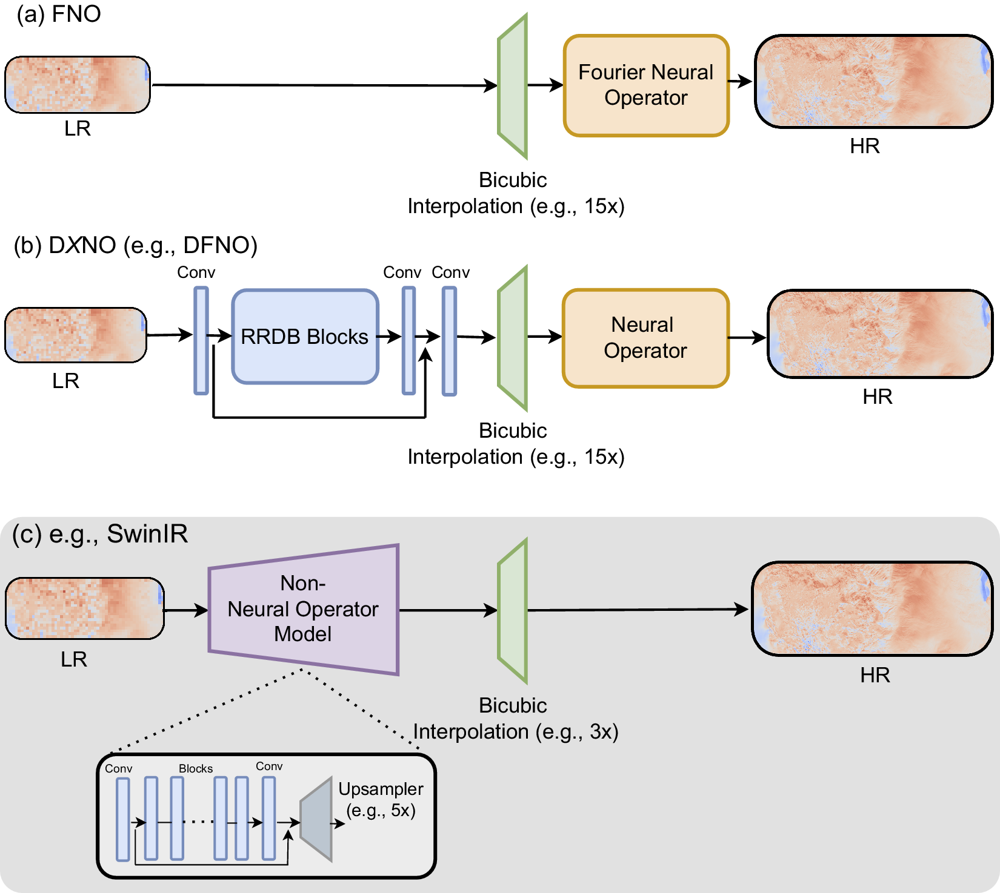

# On the effectiveness of neural operators at zero-shot weather downscaling

## Overview

Overall, our work investigates the zero-shot downscaling potential of neural operators. To summarize, our contributions are:

1. We provide a comparative analysis based on two challenging weather downscaling problems, between various neural operator and non-neural-operator methods with large upsampling factors (e.g., 8x and 15x) and fine grid resolutions (e.g., 2 km × 2 km wind speed).

2. We examine whether neural operator layers provide unique advantages when testing downscaling models on upsampling factors higher than those seen during training, i.e., zero-shot downscaling. Our results instead show the surprising success of an approach that combines a powerful transformer-based model with a parameter-free interpolation step at zero-shot weather downscaling.

3. We find that this Swin-Transformer-based approach mostly outperforms all neural operator models in terms of average error metrics, whereas an enhanced super-resolution generative adversarial network (ESRGAN)-based approach is better than most models in capturing the physics of the system, and suggests their use in future work as strong baselines. However, these approaches still do not capture variations at smaller spatial scales well, including the physical characteristics of turbulence in the HR data. This suggests a potential for improvement in transformer or GAN-based methods and neural-operator-based methods for zero-shot weather downscaling.

<p align="center">
  
</p>

<p align="center"><em>Overview of the neural operator and non-neural-operator zero-shot weather downscaling approaches. We show 5x to 15x zero-shot downscaling as an example.</em></p>

This codebase builds upon:
- [SuperBench](https://github.com/erichson/SuperBench)
- [neuraloperator](https://github.com/neuraloperator/neuraloperator)

## Setup

### 1. Clone the Repository

```bash
git clone https://github.com/NREL/neural-operators-weather-downscaling.git
cd neural-operators-weather-downscaling
```

### 2. Create the Conda Environment

```bash
conda env create -f environment.yml
conda activate downscaling
```

## Usage

### 1. Model Training

Baseline models are trained using the script located at:

`scripts/baseline/train.sh` → calls `scripts/baseline/train.py`  
  **Models trained:**  
  - SRCNN  
  - EDSR  
  - ESRGAN  
  - SwinIR  

Neural operator models are trained using the script located at:

`scripts/neuraloperator/train.sh` → calls `scripts/neuraloperator/train.py`  
  **Models trained:**  
  - FNO  
  - DFNO  
  - DUNO  
  - DAFNO  
  - DCNO  

Run training using:

```bash
sbatch scripts/baseline/train.sh         # for baseline models
sbatch scripts/neuraloperator/train.sh   # for neural operator models
```

For descriptions of all the baseline and neural operator models, please refer to our paper.

**Note:** We configure `.sh` scripts for SLURM-based scheduling and all models are trained on a single GPU node. 

The train.sh scripts contain hyperparameter details including references to configuration files. 

**Model implementations are located in:**  
- `src/baseline_models/` — for SRCNN, EDSR, ESRGAN, SwinIR  
- `src/neuraloperators/neuralop/models/` — for FNO, DFNO, DUNO, DAFNO, DCNO

### 2. Model Evaluation

Refer to `scripts/baseline/eval.sh` and `scripts/neuraloperator/eval.sh` for evaluating baseline and neural operator models, respectively. Each `eval.sh` script internally calls its corresponding Python script—`scripts/baseline/eval.py` or `scripts/neuraloperator/eval.py`.

To perform **zero-shot evaluation**, specific zero-shot arguments are included when calling these Python scripts.  
Please refer to the respective `.sh` files for details on how these arguments are configured.

Run evaluation using:

```bash
sbatch scripts/baseline/eval.sh         # for baseline models
sbatch scripts/neuraloperator/eval.sh   # for neural operator models
```

### 3. Result Analysis

The `result_analysis/` folder contains utilities for visualizing model outputs and energy spectra of the downscaled outputs.

- `plot_outputs.py`: Visualizes sample downscaled outputs for comparison across models.
- `energy_spectrum.py`: Computes and compares the kinetic energy spectrum plots for each model which shows a distribution of energy across various wavenumbers.

For detailed results and analysis, please refer to our paper.

## Citation

If you use this codebase or ideas from this project in your work, please cite:

```
@article{sinha2025effectiveness,
  title={On the effectiveness of neural operators at zero-shot weather downscaling},
  author={Sinha, Saumya and Benton, Brandon and Emami, Patrick},
  journal={Environmental Data Science},
  volume={4},
  pages={e21},
  year={2025},
  publisher={Cambridge University Press}
}
```
